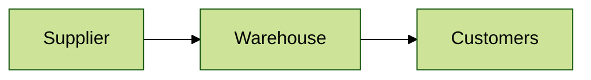

### Demand planning, supply chain management

In this module we will work with data about physical goods of our store, full path from supplier to customer \
This module is simplified and only include creation of fully-functional demand planning model, with disregard of courier
part, as if good teleported directly to customers without any cost

