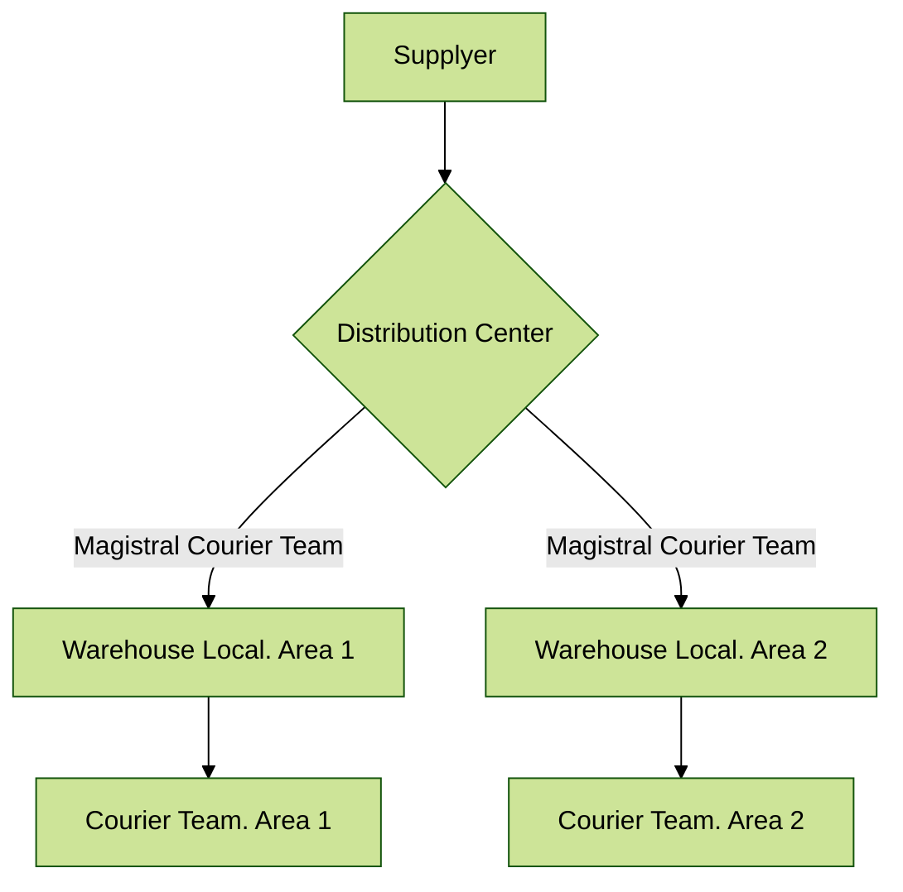

### Couriers

This module takes the demand planning concept and applies it to a more realistic environment.
Our e-store will have a large distribution center for suppliers, allowing our procurement department to place centralized 
orders in order to always satisfy minimum order requirements and take advantage of scale effect on larger deliveries.

However, it is located outside of city, and we deliver to many addresses within the town and suburbs.
To address this issue, we are introducing smaller warehouses, specifically for quick delivery and cost reduction in logistics.

