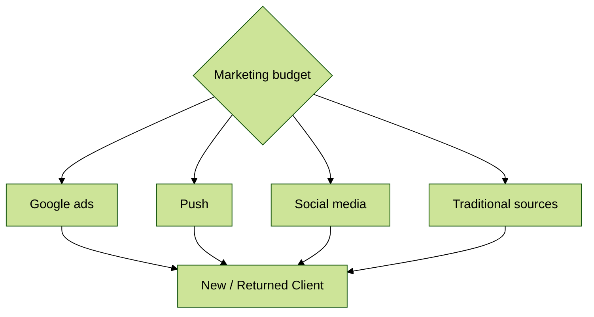

```mermaid
flowchart TD
%%{init: {'theme':'forest'}}%%
A{Marketing budget} --> B[Google ads]
A --> C[Push]
A --> D[Social media]
A --> E[Traditional sources]
B --> F[New / Returned Client]
C --> F[New / Returned Client]
D --> F[New / Returned Client]
E --> F[New / Returned Client]
```